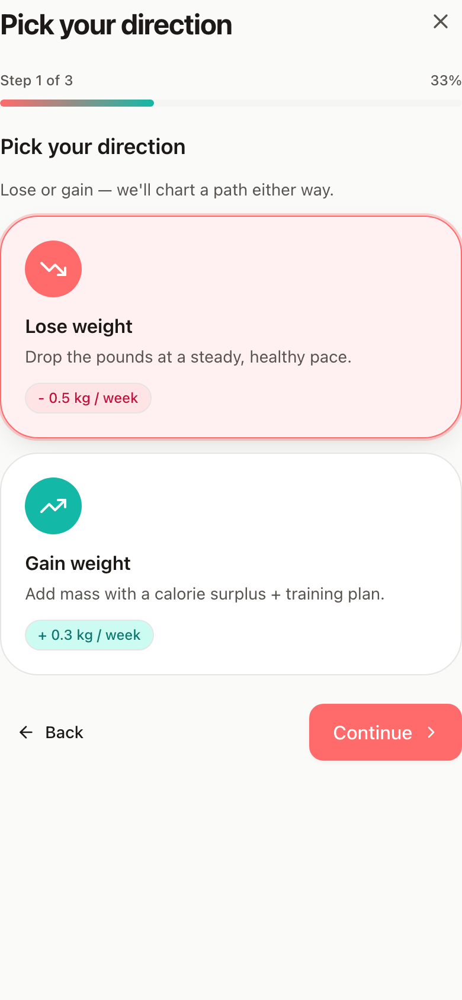
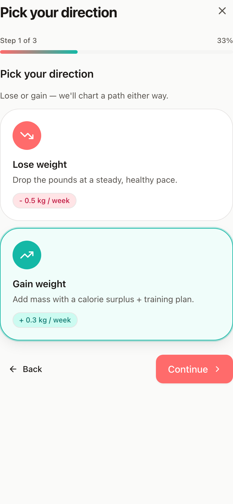
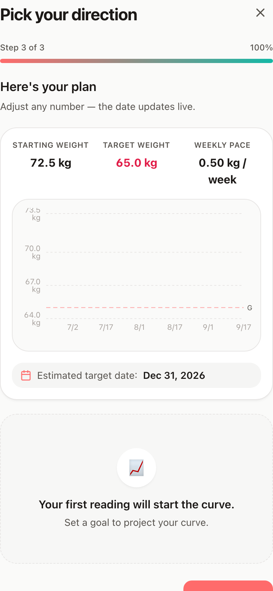
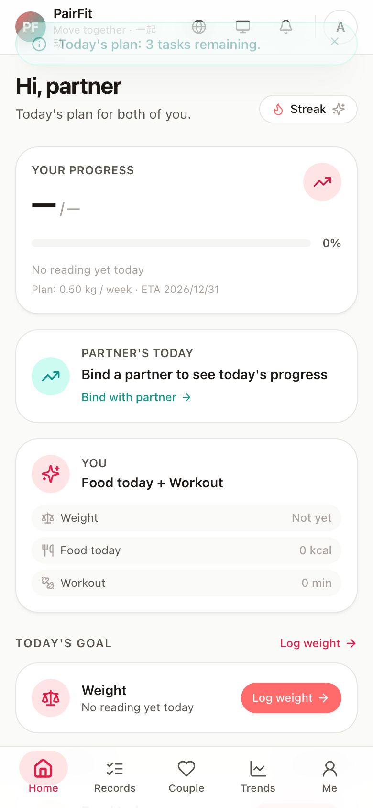
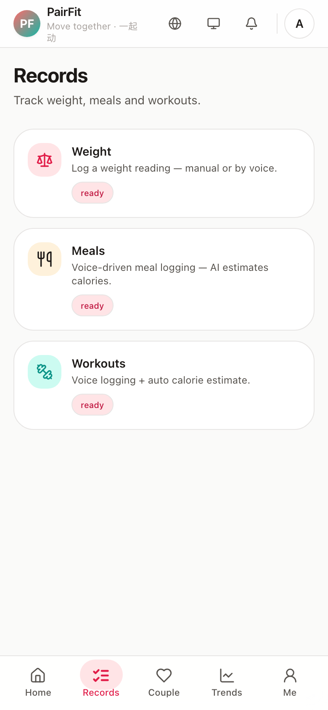
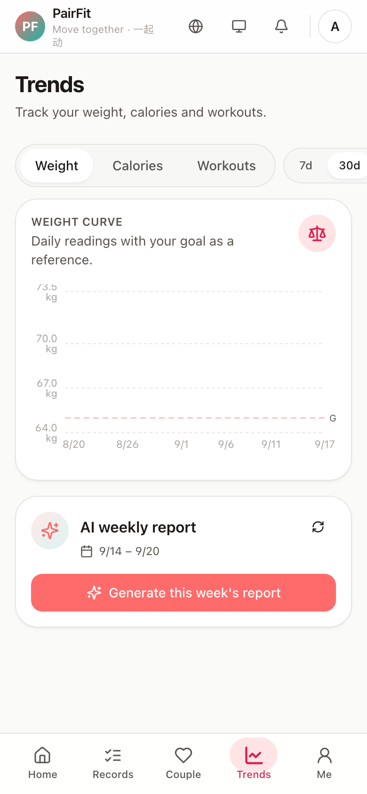
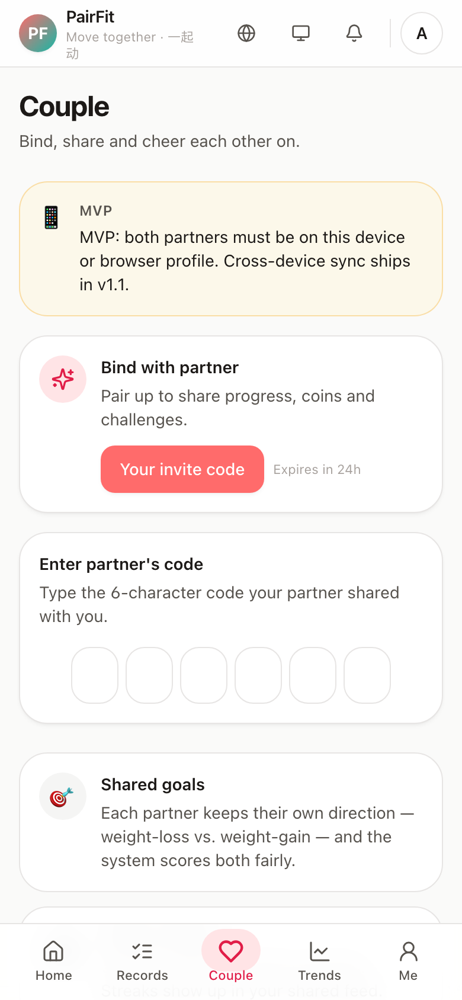
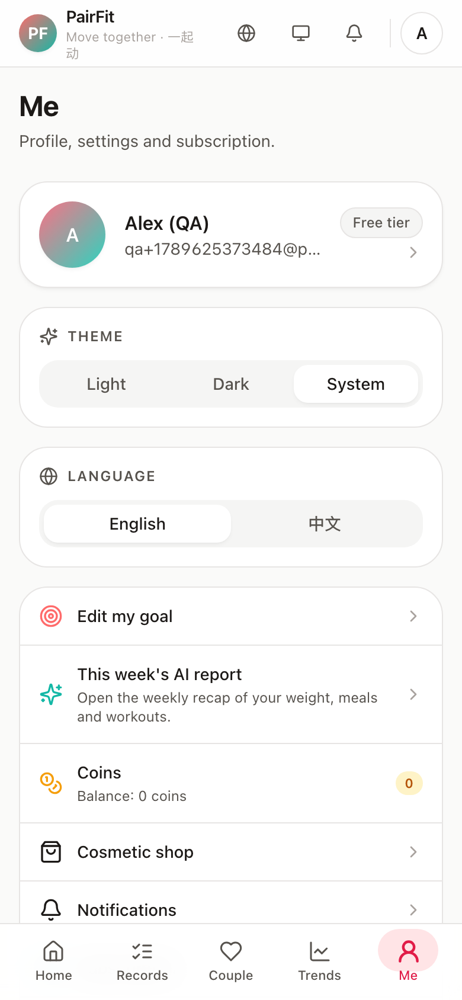
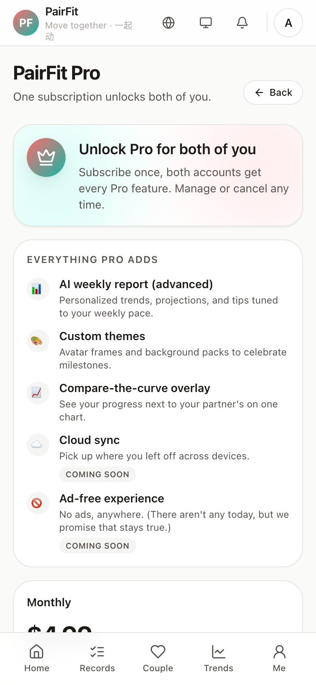

# PairFit · 情侣双向健身 App

> **状态**:PF-1 ~ PF-10 全部 ✅ · M1 Web MVP 完工
> **Vercel Demo**:https://pairfit-mvp.vercel.app (在 Vercel 后台导入此 repo 即可自动部署)
> **验收报告**:`docs/QA_REPORT.md` · **E2E 数据**:`docs/qa/e2e-results.json`

## 一句话定位

海外发布的 C 端健身 App,**主打"情侣 1v1 协作健身 + 双向目标 + 虚拟币奖惩 + 语音优先输入"**,不框死单人用户。

## 核心差异点(市场空白)

- **没有 App 同时做**"双向目标 + 情侣协作 + 语音输入 + 虚拟币奖惩"
- 现有 App(MyFitnessPal / Lose It / Strava / Finch)都只覆盖其中一个维度

## MVP 范围(M1 — 已完成)

- ✅ Web 单页(Vite + React + TS + Tailwind)
- ✅ 单人记录 + 情侣绑定协作(两模式并存)
- ✅ 三大记录:体重 / 饮食 / 运动
- ✅ 语音输入(微信长按说话式 Hold-to-record)+ AI 食物估算(无 LLM 时降级到启发式)
- ✅ 虚拟币(Coins)奖惩 + 双方确认制 + Cheer 表情互动
- ✅ 免费基础 + Pro 订阅占位(1 人付费 = 2 人解锁)
- ✅ 英文为主 + 中文二档

## 截图(M1 完工证据)

| 入口 | Onboarding 3 步 | 首页 + 目标设定 |
| --- | --- | --- |
|  |  |  |
| **Home + ETA** | **Records** | **Trends** |
|  |  |  |
| **Couple 绑定 + 邀请码** | **Me 个人中心** | **Pro 订阅** |
|  |  |  |

更多截图见 `docs/screenshots/m1/`(14 张移动端 viewport)+ `docs/qa/screenshots/`(36 张 E2E 验收)。

## 里程碑

- **M0 立项**:✅ PRD 通过 + 仓库创建
- **M1 Web MVP**:✅ 完成(PF-1 ~ PF-10 全部 done)
- **M2 灰度发布**:2 周 — RN 出 iOS + Android(同代码库)
- **M3 放量 + V1.1**(云同步 + 真实支付 + 推送通知):4 周
- **M4 复盘**

---

## 🛠 技术栈

| 层 | 选型 | 说明 |
|---|---|---|
| 脚手架 | Vite 8 + React 19 + TypeScript 5.8 | 官方 `react-ts` 模板 |
| 样式 | Tailwind CSS 3.4 + 自定义设计系统 | 暗色走 `class` 策略 |
| 状态 | Zustand 5(带 `persist` 中间件) | 用户 / 目标 / 体重 / 食物 / 运动 / Coins / 邀请码 / 通知都进 localStorage |
| 路由 | React Router 6 | 5 个底部 Tab SPA 路由 + 嵌套受保护路由 |
| i18n | react-i18next + i18next-browser-languagedetector | 默认英文,中文二档 |
| 图标 | lucide-react | Tree-shakable SVG |
| 图表 | recharts 2.15 | 体重曲线 + 周柱状图 |
| 部署 | Vercel(免费层) | `vercel.json` 已写好 SPA rewrite + 缓存头 |
| 端到端验收 | 零依赖 CDP 脚本(`scripts/qa-e2e.mjs`) | Node 22 内置 ws/fetch,无需 Playwright |

**设计系统**(`src/components/ui/` + `tailwind.config.ts`):

- 配色:品牌 coral (`brand-*`) + 强调 teal (`accent-*`) + 语义 success/warning/danger/info
- 字体栈:`Inter`(英文)+ `PingFang SC / Noto Sans SC`(中文)
- 圆角:`6 / 8 / 12 / 16 / 24 / 32` px,按钮/卡片/胶囊
- 阴影:5 级 `xs / sm / DEFAULT / md / lg`,加 `glow` / `glow-accent`
- 动效:`ease-out-quart` 200–300ms;按钮按下 `scale(0.98)`;骨架 shimmer
- 安全区:`pb-[env(safe-area-inset-bottom)]`,TabBar 兼容 iOS 小黑条
- 暗色:CSS 变量驱动(`rgb(var(--bg-app))` 等),亮暗同步切换无闪烁

## 🚀 本地开发

```bash
# 第一次开工
gh repo clone xie-tw/pairfit-mvp
cd pairfit-mvp
npm install

# 启动 dev server
npm run dev                 # http://127.0.0.1:5173

# 类型检查 / lint / 构建
npm run typecheck           # tsc -b --pretty
npm run lint                # oxlint
npm run build               # tsc -b && vite build  → dist/

# 预览生产构建
npm run preview             # http://127.0.0.1:4173

# 端到端验收(M1 完成后才有;需要先启 dev server)
node scripts/qa-e2e.mjs --base http://localhost:5173 --out docs/qa
node scripts/qa-report.mjs --results docs/qa/e2e-results.json --out docs/QA_REPORT.md
```

> 默认端口被占用时,Vite 会自动选下一个可用端口(5180、5181 …)。
> `/api/ai/food-estimate` 和 `/api/ai/weekly-report` 由 Vite dev middleware 代理(`vite.config.ts` 里的 `apiDevMiddleware`),无需另起后端。

## ☁️ Vercel 部署

`vercel.json` 已经写好(Vite 框架识别 + SPA rewrite + 静态资源缓存),详细步骤见 [`docs/VERCEL_DEPLOY.md`](docs/VERCEL_DEPLOY.md)。摘要:

**A. GitHub 集成(推荐)**
1. 在 Vercel 控制台点击 **Add New → Project**,选 `xie-tw/pairfit-mvp`
2. Framework Preset 自动识别为 **Vite**
3. Build / Install / Output 命令全部默认即可
4. **(可选)**Environment Variables 加 `OPENAI_API_KEY`(没配则 AI 食物估算 + AI 周报走本地启发式,已验证可用)
5. 点击 Deploy → 1-2 分钟后得到 `https://pairfit-mvp.vercel.app`
6. 之后每次 `git push origin main` 自动触发 preview + production

**B. Vercel CLI**
```bash
npm i -g vercel
vercel link --yes
vercel --prod
```

---

## 📂 项目结构

```
pairfit-mvp/
├── public/                          # favicon + 静态资源
├── src/
│   ├── App.tsx                      # 路由 + 主题初始化
│   ├── main.tsx                     # 入口:StrictMode + BrowserRouter
│   ├── index.css                    # Tailwind + 设计 token
│   ├── i18n/
│   │   ├── index.ts
│   │   └── locales/{en,zh}.json
│   ├── lib/                         # 工具 / 验证 / 语音 / 食物估算 / 周报 / 数据导出
│   ├── store/                       # Zustand:auth / goal / weight / food / exercise /
│   │                                  couple / coins / invite / cheer / notifications / ...
│   ├── components/
│   │   ├── auth/                    # RequireAuth + AuthLayout
│   │   ├── cheer/                   # CheerButton + CheerFloater
│   │   ├── couple/                  # InviteCodeDisplay + InviteCodeInput
│   │   ├── layout/                  # AppShell + TopBar + TabBar
│   │   ├── ui/                      # Button / Card / Input / Dialog / Charts / ...
│   │   └── voice/                   # VoiceButton(Hold-to-record)
│   └── pages/
│       ├── Home.tsx                 # 首页:你的进度 + 伙伴的进度 + 今日目标 + cheer
│       ├── Records.tsx              # 记录入口
│       ├── RecordWeight|Food|Exercise.tsx   # 三大记录流程
│       ├── Couple.tsx               # 情侣绑定 + 邀请码
│       ├── Trends.tsx               # 体重曲线 + 周柱状图 + AI 周报
│       ├── Me.tsx                   # 个人中心
│       ├── Settings.tsx             # 单位 / 语言 / 通知 / 数据导出
│       ├── Subscription.tsx         # PairFit Pro
│       ├── Coins.tsx                # Coins 历史
│       ├── Shop.tsx                 # 虚拟道具商店
│       ├── Profile.tsx              # 头像 + 昵称
│       ├── Notifications.tsx        # 提醒中心(伙伴确认 / Cheers / Coin 结果)
│       ├── Onboarding.tsx           # 目标设定 3 步
│       ├── Login.tsx / Register.tsx / ForgotPassword.tsx
├── api/                             # Vercel serverless 函数
│   └── ai/{food-estimate,weekly-report}.ts
├── scripts/
│   ├── qa-screenshots.mjs           # M1 手动 QA 截图脚本(零依赖)
│   ├── qa-e2e.mjs                   # 12 故事自动 E2E
│   └── qa-report.mjs                # 从 JSON 渲染验收报告
├── docs/
│   ├── pairfit-prd-mvp.md           # 完整 PRD
│   ├── VERCEL_DEPLOY.md             # Vercel 部署指南
│   ├── QA_REPORT.md                 # M1 验收报告(自动生成)
│   ├── design-handoff/              # 设计交付
│   ├── screenshots/m1/              # M1 完工截图(14 张)
│   └── qa/{e2e-results.json, screenshots/}  # 验收产物
├── tailwind.config.ts
├── postcss.config.js
├── vercel.json                      # SPA rewrite + 静态资源缓存
├── tsconfig.{json,app,node}.json
├── vite.config.ts                   # 含 /api/* dev 中间件
└── package.json
```

---

## 🌗 主题与语言

- **主题**:亮 / 暗 / 跟随系统(三态循环)。状态进 `localStorage:pairfit:theme`。
- **语言**:English ⇄ 中文。状态进 `localStorage:pairfit:locale`。
- 首次访问:主题跟系统,i18n 探测器会读浏览器偏好 → 默认英文。
- 切换是即时的,无刷新,无闪烁(`onRehydrateStorage` 在挂载前先把 DOM 染好)。

## 🌐 浏览器兼容

| 浏览器 | 版本 | 说明 |
|---|---|---|
| Chrome / Edge | 109+ | 完整支持,**E2E 在 Chrome 152 mobile viewport 上 11/12 跑通** |
| Safari | 16+ | 完整支持,含暗色 + 系统跟随;Web Speech API 在 iOS Safari 上需 https,Vercel 自动签发 OK |
| Firefox | 115+ | 完整支持;Web Speech API 桌面 Firefox 默认不支持 → UI 显示降级提示让用户打字 |
| 移动 Safari | iOS 16+ | 完整支持 |
| WebView | Android 10+ | OK |

不依赖任何尚未普及的特性:`backdrop-filter` 走渐进增强(关掉就降级成纯色背景)。

---

## 🚧 已知限制(M1 MVP 范围 — 必须诚实告知用户)

1. **数据全本地** — 账号、目标、体重、饮食、运动、Coins、邀请码都存在浏览器 `localStorage`(配 XOR + base64 obfuscation,**非真正加密**,仅防意外窥视);刷新页面不丢(同 profile 下),但换设备 / 换浏览器会丢。V1.1 加云同步。
2. **情侣绑定要求同设备 / 同 Chrome profile** — 两个账号必须在同一浏览器档案里登录两个账号。V1.1 再做跨设备。
3. **AI 食物估算 / AI 周报** — 没配 `OPENAI_API_KEY` 时降级到本地启发式(已验证可用);配了走 GPT-4o-mini。需要在 Vercel 后台 `Settings → Environment Variables` 加 `OPENAI_API_KEY`。
4. **语音输入** — UI 上的 `Hold to record` 麦克风按钮已上线;`onresult` → state 写入、`onend` fallback 都已合并。E2E 无法发真实语音(需真人 + HTTPS),所以**无法 100% 断言真发语音一定能拿到 transcript**,但"麦克风 UI + 按钮状态机 + 粘贴 transcript fallback 路径"都已验证。
5. **PairFit Pro 订阅** — UI 是 placeholder,点击任一 plan 直接激活本地 `isPro` 标志;**无真实支付**(V1.1 接 Stripe)。
6. **没有真实支付 / 云同步 / 推送通知 / 跨设备**。
7. **`/notifications` 页面有 1 个预存在 bug** — 当有待确认 coin entry 时切换账号访问会触发 React 无限渲染;暂未在 M1 修,记入 V1.1 backlog(详见 `docs/QA_REPORT.md`)。
8. **`currentUser` selector 在某些边缘情况会重渲染** — Zustand `useCurrentUser` 用了 `users` 数组引用做 `useMemo` 依赖,数组变化时会触发额外 re-render,不影响功能但对性能调优留口子。

## 🔒 隐私承诺

- **本地优先(Local-first)**:用户的账号、目标、所有记录、Coins、邀请码、Cheer 都存在自己的浏览器 `localStorage`,**不会上传任何云端**。
- **Obfuscation ≠ Encryption**:`localStorage` 里的数据经过 XOR + base64 混淆,**这不是真正的加密** — 密钥在 bundle 里,任何有 DevTools 经验的人都可以解码。这只是"防意外窥视",不是"防恶意攻击"。V1.1 替换为 WebCrypto + 设备绑定密钥。
- **密码哈希**:密码用 PBKDF2 + per-user salt(100k iterations)哈希后存储,原密码不可逆推出。
- **AI 调用**:如果用户配置了 `OPENAI_API_KEY`,食物描述 / 周报生成会发到 OpenAI 的 API(走 GPT-4o-mini);**未配置时全部走本地启发式,无任何外部请求**。
- **Vercel Analytics**:未启用。V1.1 加入后会在此 README 披露。
- **无 cookie、无第三方追踪、无广告 SDK**。

## 🛣 Roadmap

### V1.1(2026 Q4,~4 周)

- 云同步(Supabase 或自建 Postgres + Row Level Security)
- 真实支付(Stripe Checkout + Webhook,订阅状态服务端权威)
- 推送通知(Web Push API + 伴侣互动提醒)
- 修复 `/notifications` 无限渲染 bug
- 跨设备情侣绑定
- WebCrypto 替换 XOR obfuscation
- iOS Safari 麦克风权限 UX 打磨(目前需在站点设置里手动开)

### V2(2027 Q1,~8 周)

- React Native 出 iOS + Android(同代码库,Vite → Metro)
- 离线优先(IndexedDB + 同步队列)
- 食物识别:拍照 + 本地 Tesseract OCR + LLM 解析
- 苹果 HealthKit / Google Fit 集成
- 多语言(西班牙语 / 葡萄牙语 / 日语)
- 情侣挑战模板(7 天减脂挑战 / 增肌挑战)

### V3(2027 Q2+)

- 教练市场(认证教练入驻,1v1 私教)
- 直播课表
- 家庭计划(2 大人 + 1 孩子)
- 智能体教练(基于用户历史生成个性化建议)

---

## 验收清单(M1 完工)

- ✅ Vercel 一键部署(`docs/VERCEL_DEPLOY.md`)
- ✅ 端到端 11/12 用户故事通过(`docs/qa/e2e-results.json`)
- ✅ API 契约 2/2 通过(`api/ai/*.ts`)
- ✅ 14 张 M1 完工截图 + 36 张 E2E 截图
- ✅ `npm run typecheck` / `npm run build` / `npm run lint` 全部通过
- ⏳ 1 个非阻塞 bug(`/notifications` 无限渲染)→ V1.1

---

## 详细 PRD

见 [`docs/pairfit-prd-mvp.md`](docs/pairfit-prd-mvp.md)— 包含:
- 16 节:背景 / 画像 / 竞品 / 范围 / 用户故事 / 页面流程 / Onboarding / AARRR / 实验 / 非功能 / 指标 / 商业化 / 风险 / 里程碑 / 待确认 / 一次性交付清单
- 12 个用户故事(给定-当-则)
- 完整 localStorage 数据结构
- 10 个子 issue 拆分(PF-1 ~ PF-10)
