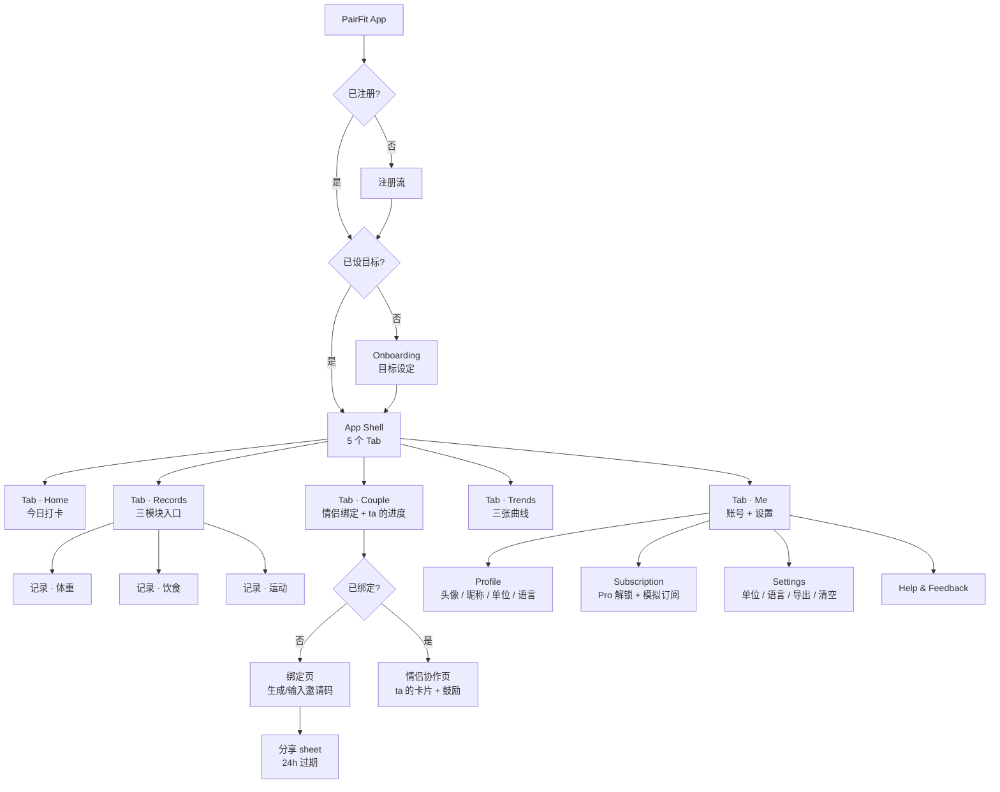
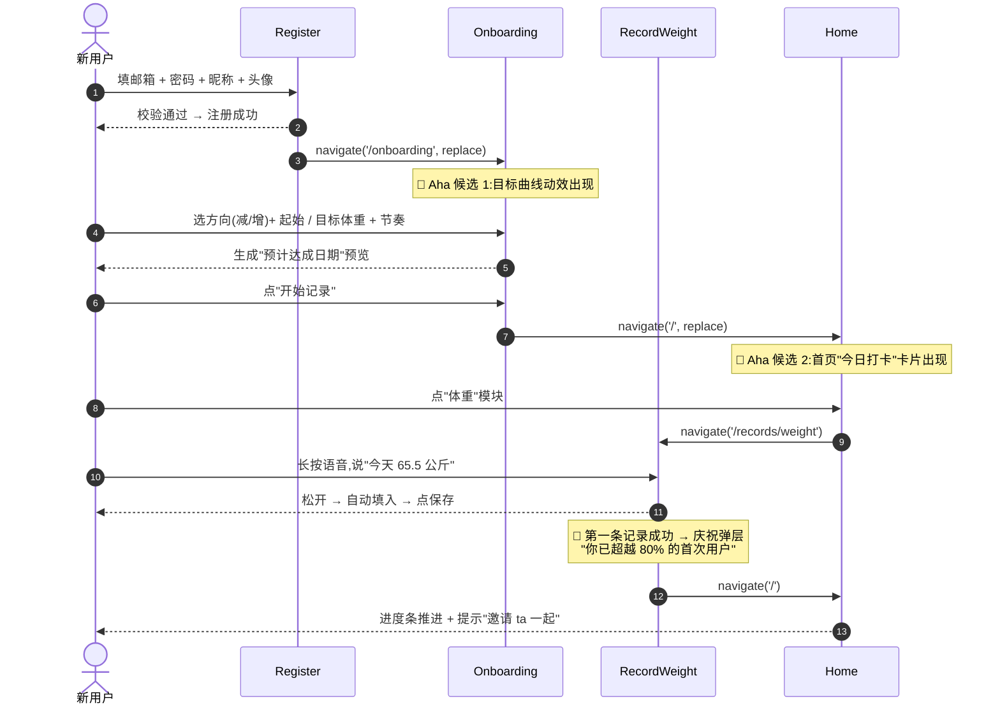
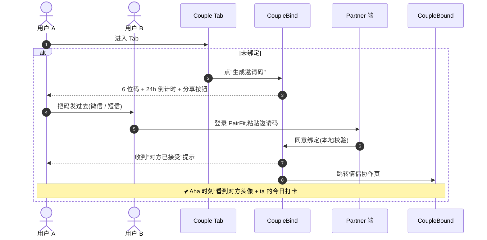
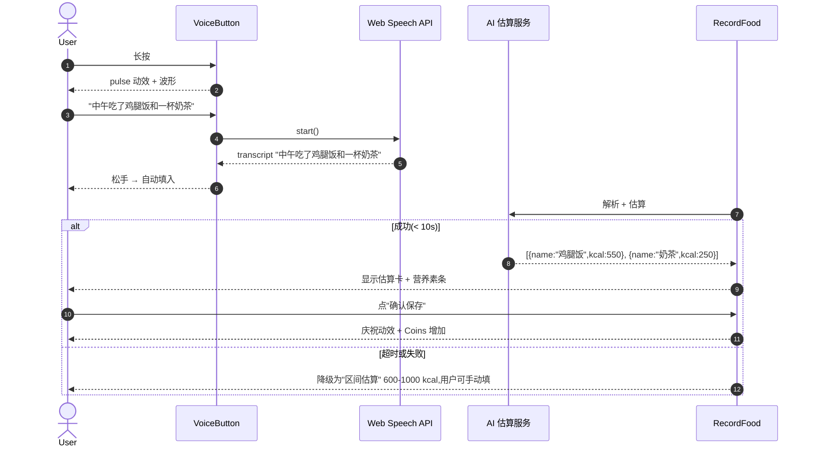

# PairFit · 信息架构与用户旅程

> 版本:v1.0 · 2026-09-14
>
> 本文档把 PRD §6「核心流程与页面」翻译成具体路由 / 导航 / 模态 / Mermaid 流程图,给 Coding Agent 接续实现用。

---

## 1. 路由表

| Path | Page | 权限 | 进入方式 |
|---|---|---|---|
| `/login` | Login | 公开 | 深链 / 注册成功 |
| `/register` | Register | 公开 | 启动 / TopBar Sign in |
| `/forgot-password` | ForgotPassword | 公开 | Login "Forgot?" 链接 |
| `/onboarding` | Onboarding | 公开 | Register 成功后 `replace` 跳转 |
| `/` | Home | RequireAuth | Tab 默认页 |
| `/records` | Records | RequireAuth | Tab |
| `/records/weight` | RecordWeight | RequireAuth | Records 卡 → |
| `/records/food` | RecordFood | RequireAuth | Records 卡 → |
| `/records/exercise` | RecordExercise | RequireAuth | Records 卡 → |
| `/couple` | Couple | RequireAuth | Tab |
| `/couple/bind` | CoupleBind | RequireAuth | Couple 主页"绑定"CTA |
| `/couple/bound` | CoupleBound | RequireAuth | 已绑定后 Couple 主页 |
| `/trends` | Trends | RequireAuth | Tab |
| `/me` | Me | 公开(已登录显示账号卡片) | Tab |
| `/me/profile` | Profile | RequireAuth | Me "Profile" 行 |
| `/me/subscription` | Subscription | RequireAuth | Me "Subscription" 行 |
| `/me/settings` | Settings | RequireAuth | Me "Settings" 行 |
| `/me/help` | Help | 公开 | Me "Help" 行 |
| `*` | NotFound | 公开 | 兜底 |

> Tab 路由(`/`, `/records`, `/couple`, `/trends`, `/me`)由 `<AppShell>` 包住,带 TopBar + TabBar。
> 非 Tab 路由(`/records/weight`, `/couple/bind`, `/profile`, …)也走 `<AppShell>`,但隐藏 TabBar(用 `<AppShell hideTabBar>`)。

---

## 2. 信息架构(Mermaid)



---

## 3. 主导航结构

### 3.1 移动端底部 Tab Bar(5 个)

固定在底部,`sticky bottom-0`,带 safe-area inset。激活态:icon 缩放 1.1,label 出现,背景 pill 用 `brand-100`。

```
┌─────────────────────────────────────────────────┐
│  🏠      📝      💕      📈      👤              │
│ Home  Records  Couple  Trends   Me               │
│  ↑                                                 │
│  brand-100 pill (active)                          │
└─────────────────────────────────────────────────┘
```

### 3.2 顶部 TopBar

固定在顶部,`sticky top-0`,透明 backdrop-blur。左侧 brand,右侧 Language toggle + Theme toggle + User menu(或 Sign in pill)。

### 3.3 模态 / Bottom Sheet 用法

- **Modal**(中心弹出):用 `pf-modal` 类,仅用于"危险确认"(解绑 / 清空所有数据 / 取消订阅)。
- **Bottom Sheet**(底部抽屉):用 `pf-sheet` 类,用于"分享邀请码 / 选择图标 / 选择表情评论"。
- **Toast**(顶部浮层):用 `pf-toast` 类,用于所有"操作反馈"提示(成功 / 警告 / 错误)。

---

## 4. 关键用户旅程(Mermaid)

### 4.1 首次注册 → 设定目标 → 第一次记录(Aha 时刻路径)



### 4.2 情侣绑定路径



### 4.3 语音录入 → AI 食物估算路径



---

## 5. 路由来源表(每个页面的入口 / 出口)

| Page | 来源 | 出口 |
|---|---|---|
| Login | TopBar Sign in / Register "signInLink" / ForgotPassword "backToLogin" | Register · Home(成功后) |
| Register | Login "signUpLink" | Login · Onboarding(成功后) |
| ForgotPassword | Login "Forgot?" | Login |
| Onboarding | Register 成功(替换式) | Home(成功后) |
| Home | Tab 默认 | 各记录页 · Couple · Trends · Me |
| Records | Tab | 三个子录入页 |
| RecordWeight | Records 卡 · Home 体重模块 | Home |
| RecordFood | Records 卡 · Home 饮食模块 | Home |
| RecordExercise | Records 卡 · Home 运动模块 | Home |
| Couple | Tab | Bind · Bound |
| CoupleBind | Couple "绑定" CTA | Bound(成功后) |
| CoupleBound | 已绑定后 Couple | Me 邀请 ta |
| Trends | Tab | — |
| Me | Tab | Profile · Subscription · Settings · Help |
| Profile | Me "Profile" 行 | Me · Sign out → Login |
| Subscription | Me "Subscription" 行 | Me(确认后) |
| Settings | Me "Settings" 行 | Me |

---

## 6. 设计意图:为什么 IA 是这样

- **5 个 Tab = 5 个用户意图**:Home = "今天我要做什么"、Records = "我想记一笔"、Couple = "ta 在干嘛"、Trends = "我做到了吗"、Me = "我的设置"。每个 Tab 一个动词,心智模型清晰。
- **Records 子路由走全屏**:PF-3 的录入流需要专注,Tab 留在底部但不强提示;避免"输入中误触 Tab"丢失数据。
- **绑定页用独立路由**(非 Modal):因为 6 位邀请码 + 24h 倒计时 + 分享按钮需要稳定的"短链"形式,便于浏览器返回 / 分享。
- **危险操作走 Modal**:解绑 / 清空数据 / 取消订阅,二次确认 + 1 秒可撤销。